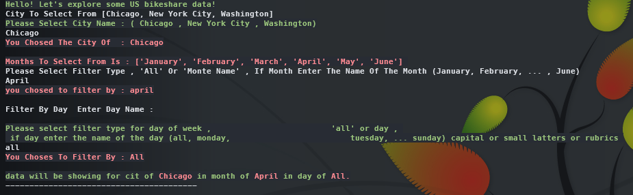
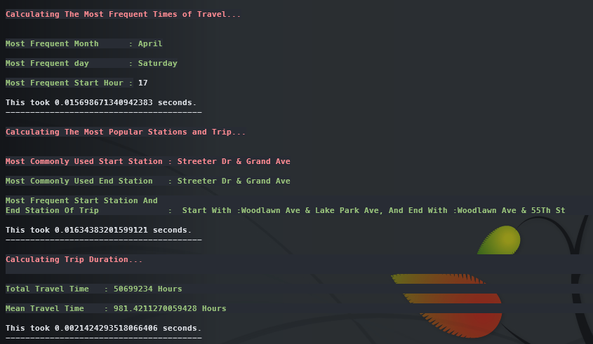
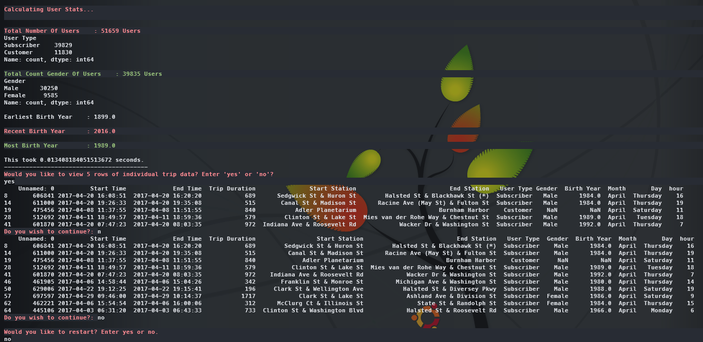

```udacity_data_analysis_us_bikshare``` - ``2021``

## ```Udacity Data Analysis NANO DEGREE```


# `US Bikeshare`

### This project demonstrates the ability to use Python on open data files and perform analysis on them, with the capability to generate shell-based colored text for insights on the data.

### An interactive shell-based Python project for exploring the US Bikeshare data from Kaggle.

--- 


### To run, use the command: 

```bash
python3 bikeshare.py
```

---

<p align="center">
  
  

  

  
</p>


---

© 2021 Udacity. All Rights Reserved.

---
